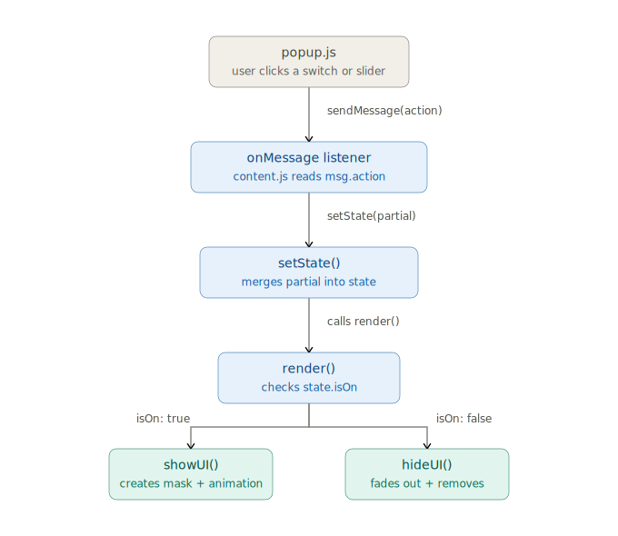
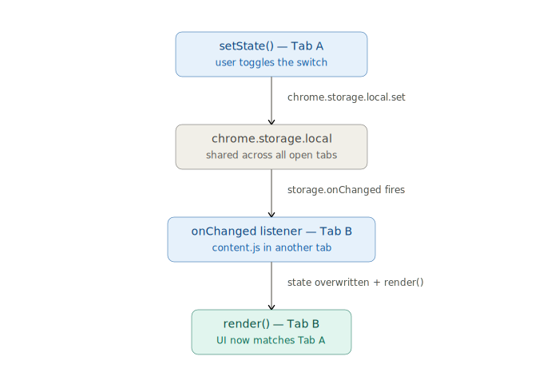

# SiteNap（讓分頁小睡一下的瀏覽器擴充功能）

一個 Chrome 擴充功能（Manifest V3），在瀏覽器畫面上疊加全螢幕遮罩，搭配可切換的視覺動畫，用於強制休息 / 專注防干擾情境。以五天的小型專案節奏開發。

## 安裝方式

此專案尚未上架 Chrome Web Store，需要手動載入：

1. 下載或 clone 這個 repo 到本機
```bash
   git clone https://github.com/a2357756/sitenap.git
```
2. 打開 Chrome，網址列輸入 `chrome://extensions`，或者點選擴充功能內的「管理擴充功能」
3. 開啟右上角的「開發人員模式」
4. 點擊「載入未封裝項目」
5. 選擇剛剛下載的 `sitenap` 資料夾（選到包含 `manifest.json` 的那一層）
6. 擴充功能列表會出現 SiteNap，點擊工具列上的圖示即可開始使用

> 若 Chrome 顯示「已停用具有開發人員模式的擴充功能」的警告，屬於正常提示，點擊「保留」即可繼續使用。

## 功能

- **手動開關**：點擊 popup 上的開關，立即啟動全螢幕遮罩
- **倒數自動關閉**：開啟前用拉桿選擇持續時間（5–100 分鐘，5 分鐘一格），時間到自動關閉，不需使用者介入
- **三種視覺模式**（可即時切換，切換時會先播放淡出動畫再換上新的）
  - 轉圈：純css動畫-呼吸縮放圓圈 + 漸層拖尾轉圈
  - 貓咪：內建 SVG 動畫素材
  - 睡覺雲：直接在html生成svg元素，透過css製作動畫效果
- **鎖定機制**：勾選鎖定後，倒數期間無法透過 popup 按鈕或 Esc 鍵提前關閉
- **強制遮罩**：開啟期間阻擋底下網頁的點擊與滾動，不會被滑鼠或滾輪意外穿透
- **跨分頁同步**：任一分頁的操作（開關、模式、鎖定）會即時同步到所有已開啟的分頁
- **狀態持久化**：關閉瀏覽器或重新整理擴充功能後，狀態不會遺失

## 使用方式

1. 點擊 Chrome 工具列的擴充功能圖示開啟 popup
2. 用拉桿選擇持續時間
3. （可選）勾選鎖定，防止自己中途手滑關掉
4. 點擊開關啟動遮罩，或按 `Esc` 快速關閉（鎖定期間 `Esc` 也會被擋下）
5. 在下方選項列切換轉圈 / 貓咪 / 睡覺雲三種視覺樣式

## 技術架構

- Chrome Extension Manifest V3
- Vanilla JavaScript（無框架、無建置流程）
- `chrome.runtime.sendMessage` / `onMessage`：popup 與 content script 之間的指令傳遞
- `chrome.storage.local` + `storage.onChanged`：跨分頁狀態同步與持久化
- CSS `@keyframes` / SVG SMIL：全部動畫效果，無額外動畫函式庫

## 專案結構

```
SiteNap
│
├── popup/          # popup UI（HTML / CSS / JS）
├── content/        # 遮罩與頁面控制邏輯（content script）
├── assets/         # 圖示與視覺素材（含貓咪 SVG 動畫）
├── docs/           # 架構圖（README 用）
├── manifest.json   # 擴充功能設定
└── background.js   # service worker
```

## 架構說明

### 單分頁內的訊息與狀態流

popup 的每一次互動（點擊開關、切換模式、勾選鎖定），都透過 `chrome.runtime.sendMessage` 送進 content script，統一由 `setState()` 合併進單一的 `state` 物件，再由 `render()` 依照最新狀態決定要顯示還是隱藏畫面。



### 跨分頁同步機制

`state` 每次更新都會寫入 `chrome.storage.local`。其他分頁的 content script 透過 `storage.onChanged` 監聽到變化後，直接覆蓋自己的本地 `state` 並重新 `render()`，因此不需要分頁之間互相發送訊息，也能維持所有分頁畫面一致。




## 作者備註

此專案為 Chrome Extension 開發的學習練習作品，使用chatgpt與claude聊天模式輔助，目標是理解popup與content script之間的訊息通訊模式、跨分頁狀態同步機制，以及純 CSS/SVG 動畫在 DOM 進退場時序上的控制。
專案靈感來源：Cat Gatekeeper `https://zokuzoku.github.io/cat-gatekeeper/`